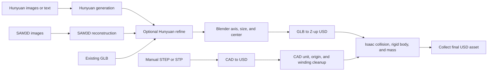

# Hunyuan Creation Pipeline

[English](./README.md) | [中文](./README.zh.md) | [Documentation](./docs/README.md)

A production pipeline for Hunyuan image/text generation, SAM 3D Objects single/multi-view reconstruction, existing GLBs, and hand-modeled STEP/STP CAD. It produces refined, sized, USD-converted assets with Isaac Sim physics data.

## Modules

| Module | Input and responsibility | Guide |
| --- | --- | --- |
| Generation method | Choose between Hunyuan and SAM3D for the available inputs and required fidelity | [Selection guide](./docs/generation-guide.md) |
| Hunyuan generation | Image directory, image URL, or text to raw GLB | [Hunyuan](./docs/modules/hunyuan.md) |
| SAM3D | Segment one/more images and reconstruct a raw GLB | [SAM3D](./docs/modules/sam3d.md) |
| Refine mesh | Hunyuan ReduceFace, Blender projection, UVs, and texture migration | [Refine](./docs/modules/refine.md) |
| Blender postprocess | Axis mapping, sizing, centering, and GLB-to-USD | [Blender](./docs/modules/blender.md) |
| Isaac physics | Collision, rigid body, materials, mass, and final collection | [Physics](./docs/modules/physics.md) |
| Manual CAD | STEP/STP-to-USD, unit/origin/hierarchy cleanup, and physics | [CAD](./docs/modules/cad.md) |
| HTTP API / Docker | Background job API and container deployment | [API](./docs/modules/api.md) / [Docker](./docker/README.md) |

## Pipeline Flow



See [Architecture](./docs/architecture.md) for code ownership and complete call flows.

## Quick Start

The stable entry point remains:

```bash
python ./run_asset_pipeline.py --help
```

### Hunyuan Image Generation

```bash
python ./run_asset_pipeline.py \
  --input-dir ./data \
  --output-dir ./downloads \
  --refine-config-path ./configs/hunyuan_reduce_local_postprocess.yaml \
  --refine-temp-upload uguu \
  --intermediate-output-dir ./output_intermediate \
  --final-output-dir ./output_final \
  --len-x 0.4 --len-y 0.3 --len-z 0.3 \
  --orientation "X=L,Y=M,Z=S" \
  --material plastic \
  --approx sdf
```

### SAM3D Image Reconstruction

```bash
python ./run_asset_pipeline.py \
  --sam3d-input ./data/sam3d_images \
  --sam3d-mode auto \
  --sam3d-prompt "metal shelves" \
  --sam3d-seed 42 \
  --sam3d-steps 50 \
  --output-dir ./sam3d_downloads \
  --refine-config-path ./configs/hunyuan_reduce_local_postprocess.yaml \
  --refine-temp-upload uguu \
  --intermediate-output-dir ./sam3d_output_intermediate \
  --final-output-dir ./sam3d_output_final \
  --len-x 0.4 --len-y 0.3 --len-z 0.8 \
  --orientation "X=L,Y=M,Z=S" \
  --approx sdf
```

The SAM3D prompt identifies the 2D segmentation target; it is not a text-to-3D description.

### Existing GLB

```bash
python ./run_asset_pipeline.py \
  --existing-glb ./input/model.glb \
  --refine-config-path ./configs/hunyuan_reduce_local_postprocess.yaml \
  --refine-temp-upload uguu \
  --intermediate-output-dir ./output_intermediate \
  --final-output-dir ./output_final \
  --len-x 0.4 --len-y 0.3 --len-z 0.3 \
  --material plastic \
  --approx sdf
```

Use `--sam3d-glb` for an existing SAM3D result. It skips SAM3D reconstruction but still runs Hunyuan refine by default.

### Manual STEP/STP

```bash
python ./run_asset_pipeline.py \
  --manual-stp ./input/manual_asset.stp \
  --cad-usd-output-dir ./manual_cad_usd \
  --intermediate-output-dir ./manual_output_intermediate \
  --final-output-dir ./manual_output_final \
  --material steel \
  --approx sdf \
  --manual-sdf-resolution 32 \
  --set-mass 30
```

Manual assets use only the STEP/STP path and avoid a CAD -> USD -> Blender -> GLB -> USD round trip. Manual CAD uses SDF resolution `32` by default; raise it to `64`, `128`, or `256` only when the collision outline is not accurate enough.

## Environment

The project uses one Python environment:

```bash
conda env create -f ./environment.yml
conda activate hunyuan_sam3d
```

Update an existing environment with
`conda env update -n hunyuan_sam3d -f ./environment.yml`. The CLI and API verify
the active environment at startup so Hunyuan, refine, and SAM3D cannot silently
run under different Python installations.

Set Tencent Cloud credentials:

```bash
export TENCENTCLOUD_SECRET_ID="your-secret-id"
export TENCENTCLOUD_SECRET_KEY="your-secret-key"
```

Override external executables when needed:

```bash
export BLENDER_BIN="$(command -v blender)"
export ISAACSIM_ROOT="../isaacsim"
export ISAAC_PYTHON="$ISAACSIM_ROOT/python.sh"
```

This example assumes Isaac Sim is at `../isaacsim` relative to the project;
replace that relative path to match the local layout. Do not commit one
machine's username or absolute installation path. Set `BLENDER_BIN` and
`ISAACSIM_ROOT` locally on each host. Docker users do not need either variable.

SAM3D automatically reuses the active `hunyuan_sam3d` Python; do not configure a
separate `SAM3D_PYTHON`. Both external repositories live under
`./tools/sam3d/third_party/` and are excluded from the main repository and Docker
build context. See the [SAM3D tool layout](./tools/sam3d/README.md).

For container deployment, use the [Docker operations guide](./docker/README.md).
The current full-image acceptance target is Isaac Sim 6.0.1; the guide covers
offline tar export/import, Hub/cache mounts, CLI and API operation, and validation.

## Code Layout

```text
run_asset_pipeline.py          Stable user entry point
serve_api.py                   Compatibility ASGI entry point
pipeline_runner.py             Compatibility exports for old imports

asset_pipeline/
  cli.py                       CLI options and source dispatch
  api.py                       FastAPI background jobs
  runtime.py                   Environment, executables, and defaults
  command.py                   Subprocess execution
  paths.py                     File discovery and output paths
  hunyuan_generation.py        Hunyuan raw-generation client
  jobs/                        Hunyuan, SAM3D, refine, Blender, and Isaac jobs
  workflows.py                 End-to-end workflow composition

tools/
  blender/                     Blender subprocess scripts
  isaac/                       Isaac Sim Python scripts
  sam3d/                       SAM3D wrapper and local third-party repositories

asset_refiner/                 Hunyuan ReduceFace and local Blender refine
configs/                       Refine configuration
docker/                        Docker and HTTP API deployment
docs/                          Module-oriented documentation
```

## Outputs

| Path | Content |
| --- | --- |
| `downloads/` | Raw Hunyuan generation results |
| `<output-dir>/sam3d/` | Prepared SAM3D images, masks, raw GLB/PLY files |
| `*_refined_mesh/` | Hunyuan targets, textures, QC, and refined GLBs |
| `output_intermediate/` | Physics-authored USD files |
| `output_final/` | Collected USD, material, and texture files |
| `*_pipeline_result.json` | Machine-readable run summary |

Generated results, model weights, local third-party checkouts, and caches are not committed to git.

## Documentation

- [Documentation index](./docs/README.md)
- [Code architecture and call graph](./docs/architecture.md)
- [Refine configuration](./configs/README.md)
- [Tool directory](./tools/README.md)
- [Docker operations](./docker/README.md)
- [HTTP API](./docs/modules/api.md)
