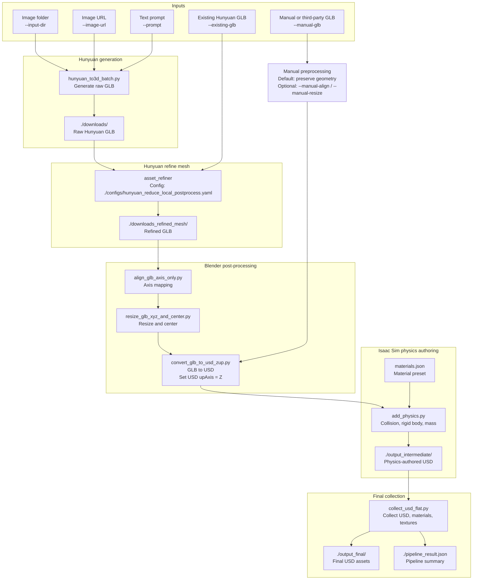

# Hunyuan Creation Pipeline

A production-oriented asset pipeline for Tencent Hunyuan 3D outputs and existing GLB models. It can generate GLB assets, refine Hunyuan meshes, convert GLB to USD, author simulation physics, and collect final USD assets for downstream use.

## Pipeline Diagram



## Features

- Generate GLB assets through Tencent Hunyuan 3D from images, image URLs, or text prompts.
- Run refine mesh on Hunyuan-generated or Hunyuan-style GLB files.
- Convert GLB files to USD and write Z-up USD stage metadata.
- Author physics materials, collision, rigid bodies, and mass through Isaac Sim.
- Collect final USD assets, materials, and textures into one output directory.
- Run the back half of the pipeline for manually modeled or third-party GLB assets.

## Pipeline Modes

### Hunyuan Generation

```text
image / image URL / prompt
-> Hunyuan GLB generation
-> refine mesh
-> axis alignment and resize
-> GLB to USD
-> add physics
-> collect final USD
```

### Existing Hunyuan GLB

```text
existing GLB
-> refine mesh
-> axis alignment and resize
-> GLB to USD
-> add physics
-> collect final USD
```

### Manual GLB

```text
existing GLB
-> GLB to USD
-> add physics
-> collect final USD
```

Manual GLB mode skips Hunyuan generation and refine mesh. By default, it preserves the authored geometry orientation and only writes USD `upAxis = "Z"` metadata.

## Requirements

- Linux environment with NVIDIA GPU support for Isaac Sim workflows.
- Conda environment created from `./environment.yml`.
- Blender.
- Isaac Sim.
- Tencent Cloud credentials for Hunyuan generation or refine mesh.

The runner auto-detects common Blender and Isaac Sim locations. If auto-detection fails, set the paths explicitly:

```bash
export BLENDER_BIN="blender"
export ISAAC_PYTHON="./isaac-sim/python.sh"
```

## Setup

Create the conda environment:

```bash
conda env create -f ./environment.yml
conda activate hunyuan
```

Update an existing environment:

```bash
conda env update -f ./environment.yml --prune
```

Set Tencent Cloud credentials when using Hunyuan generation or refine mesh:

```bash
export TENCENTCLOUD_SECRET_ID="your-secret-id"
export TENCENTCLOUD_SECRET_KEY="your-secret-key"
```

Do not commit real credentials.

## Usage

### 1. Full Hunyuan Pipeline

Place input images in `./data/`, then run:

```bash
python ./run_asset_pipeline.py \
  --input-dir ./data \
  --output-dir ./downloads \
  --intermediate-output-dir ./output_intermediate \
  --final-output-dir ./output_final \
  --result-json ./pipeline_result.json \
  --face-count 150000 \
  --len-x 0.4 \
  --len-y 0.3 \
  --len-z 0.3 \
  --orientation "X=L,Y=M,Z=S" \
  --material plastic \
  --approx sdf
```

### 2. Existing Hunyuan GLB

```bash
python ./run_asset_pipeline.py \
  --existing-glb ./downloads/example_asset \
  --intermediate-output-dir ./output_intermediate \
  --final-output-dir ./output_final \
  --result-json ./pipeline_result.json \
  --len-x 0.4 \
  --len-y 0.3 \
  --len-z 0.3 \
  --material plastic \
  --approx sdf
```

### 3. Manual GLB

```bash
python ./run_asset_pipeline.py \
  --manual-glb ./input/manual_asset.glb \
  --intermediate-output-dir ./manual_output_intermediate \
  --final-output-dir ./manual_output_final \
  --result-json ./manual_pipeline_result.json \
  --material steel \
  --approx sdf \
  --set-mass 30
```

If the manual model also needs the pipeline axis mapping or resize step, add:

```bash
  --manual-align \
  --manual-resize \
  --len-x 0.6 \
  --len-y 0.4 \
  --len-z 0.5
```

## Key Options

| Option | Description |
| --- | --- |
| `--input-dir` | Input image directory for Hunyuan generation. |
| `--prompt` | Text prompt for Hunyuan text-to-3D generation. |
| `--image-url` | Image URL for Hunyuan image-to-3D generation. |
| `--existing-glb` | Existing Hunyuan GLB path; still runs refine mesh. |
| `--manual-glb` | Manual or third-party GLB path; skips Hunyuan and refine mesh. |
| `--len-x`, `--len-y`, `--len-z` | Target size in meters. |
| `--orientation` | Axis mapping consumed by `align_glb_axis_only.py`. |
| `--material` | Material name from `./materials.json`. |
| `--approx` | Collision approximation, such as `sdf`, `convexHull`, or `triangleMesh`. |
| `--set-mass` | Total asset mass in kilograms. |
| `--skip-refine` | Skip refine mesh for existing GLB workflows. |
| `--usd-format` | USD output format, such as `usd` or `usda`. |

Print the full CLI reference:

```bash
python ./run_asset_pipeline.py --help
```

## Coordinate And Mass Conventions

- Output USD stages are authored with `upAxis = "Z"`.
- Manual GLB mode preserves source geometry orientation by default.
- `--set-mass` means total asset mass, not the mass of one individual mesh.
- If an asset contains multiple rigid bodies, the total mass is distributed by volume weight.
- If `--set-mass` is omitted, mass is estimated from material density and mesh volume.

## Outputs

```text
./downloads/                  Raw Hunyuan generation results
./downloads_refined_mesh/      Refined GLB files and intermediate files
./output_intermediate/         USD files after physics authoring
./output_final/                Final collected USD assets
./pipeline_result.json         Machine-readable pipeline summary
```

Generated assets, caches, logs, and local environment files are ignored by git.

## Project Layout

```text
./run_asset_pipeline.py          Main runner
./pipeline_runner.py             Pipeline orchestration
./hunyuan_to3d_batch.py          Hunyuan generation client
./asset_refiner/                 Refine mesh package
./align_glb_axis_only.py         GLB axis mapping
./resize_glb_xyz_and_center.py   GLB resize and centering
./convert_glb_to_usd_zup.py      GLB to USD conversion
./add_physics.py                 Isaac Sim physics authoring
./collect_usd_flat.py            Final USD collection
./configs/                       Refine mesh configs
./materials.json                 Physics material presets
```

Docker and HTTP API usage are documented in `./README.docker.md`.
