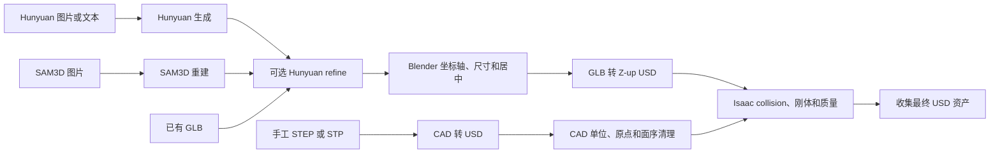

# Hunyuan Creation Pipeline

[English](./README.md) | [中文](./README.zh.md) | [文档索引](./docs/README.zh.md)

这是一个 3D 资产生产流水线。它支持 Hunyuan 图片/文本生成、SAM 3D Objects 单图/多图重建、已有 GLB，以及手工 STEP/STP CAD；输出经过拓扑精修、坐标和尺寸处理、USD 转换及 Isaac Sim 物理挂载的资产。

## 模块

| 模块 | 输入与职责 | 详细文档 |
| --- | --- | --- |
| 生成方式选择 | 根据现有输入和还原要求选择 Hunyuan 或 SAM3D | [选择指南](./docs/generation-guide.zh.md) |
| Hunyuan 生成 | 图片目录、图片 URL 或文本生成原始 GLB | [Hunyuan](./docs/modules/hunyuan.zh.md) |
| SAM3D | 单张/多张图片分割并重建原始 GLB | [SAM3D](./docs/modules/sam3d.zh.md) |
| Refine Mesh | Hunyuan ReduceFace、Blender 投影、UV 和贴图迁移 | [Refine](./docs/modules/refine.zh.md) |
| Blender 后处理 | 坐标轴、尺寸、居中和 GLB-to-USD | [Blender](./docs/modules/blender.zh.md) |
| Isaac 物理 | collision、rigid body、材质、质量和最终收集 | [Physics](./docs/modules/physics.zh.md) |
| 手工 CAD | STEP/STP 转 USD、单位/原点/层级清理和物理挂载 | [CAD](./docs/modules/cad.zh.md) |
| HTTP API / Docker | 后台任务接口与容器部署 | [API](./docs/modules/api.zh.md) / [Docker](./docker/README.zh.md) |

## 总体流程



[查看流程图 PNG](./docs/images/pipeline-flow.zh.png) | [SVG](./docs/images/pipeline-flow.zh.svg) | [Mermaid 源文件](./docs/images/pipeline-flow.zh.mmd)

代码层次和完整函数调用关系见 [架构说明](./docs/architecture.zh.md)。

## 快速开始

主入口保持不变：

```bash
python ./run_asset_pipeline.py --help
```

### Hunyuan 图片生成

```bash
python ./run_asset_pipeline.py \
  --input-dir ./data \
  --output-dir ./downloads \
  --refine-config-path ./configs/hunyuan_reduce_local_postprocess.yaml \
  --refine-temp-upload uguu \
  --intermediate-output-dir ./output_intermediate \
  --final-output-dir ./output_final \
  --len-x 0.4 --len-y 0.3 --len-z 0.3 \
  --orientation "X=L,Y=M,Z=S" \
  --material plastic \
  --approx sdf
```

### SAM3D 图片重建

```bash
python ./run_asset_pipeline.py \
  --sam3d-input ./data/sam3d_images \
  --sam3d-mode auto \
  --sam3d-prompt "metal shelves" \
  --sam3d-seed 42 \
  --sam3d-steps 50 \
  --output-dir ./sam3d_downloads \
  --refine-config-path ./configs/hunyuan_reduce_local_postprocess.yaml \
  --refine-temp-upload uguu \
  --intermediate-output-dir ./sam3d_output_intermediate \
  --final-output-dir ./sam3d_output_final \
  --len-x 0.4 --len-y 0.3 --len-z 0.8 \
  --orientation "X=L,Y=M,Z=S" \
  --approx sdf
```

SAM3D 的 prompt 用于二维分割目标，不是 text-to-3D 描述。

### 已有 GLB

```bash
python ./run_asset_pipeline.py \
  --existing-glb ./input/model.glb \
  --refine-config-path ./configs/hunyuan_reduce_local_postprocess.yaml \
  --refine-temp-upload uguu \
  --intermediate-output-dir ./output_intermediate \
  --final-output-dir ./output_final \
  --len-x 0.4 --len-y 0.3 --len-z 0.3 \
  --material plastic \
  --approx sdf
```

已有 SAM3D GLB 使用 `--sam3d-glb`；它跳过 SAM3D 重建，但默认仍经过 Hunyuan refine。

### 手工 STEP/STP

```bash
python ./run_asset_pipeline.py \
  --manual-stp ./input/manual_asset.stp \
  --cad-usd-output-dir ./manual_cad_usd \
  --intermediate-output-dir ./manual_output_intermediate \
  --final-output-dir ./manual_output_final \
  --material steel \
  --approx sdf \
  --manual-sdf-resolution 32 \
  --set-mass 30
```

手工建模只保留 STEP/STP 路径，不再做 CAD -> USD -> Blender -> GLB -> USD 往返转换。手工 CAD 的 SDF 默认分辨率为 `32`；只有碰撞轮廓不够准确时才需要提高到 `64`、`128` 或 `256`。

## 环境

项目只使用一个 Python 环境：

```bash
conda env create -f ./environment.yml
conda activate hunyuan_sam3d
```

已有环境可用 `conda env update -n hunyuan_sam3d -f ./environment.yml` 更新。CLI 和 API
启动时会检查当前环境，未激活 `hunyuan_sam3d` 会直接给出错误，避免 Hunyuan、refine
和 SAM3D 被不同 Python 环境拆开执行。

设置腾讯云凭据：

```bash
export TENCENTCLOUD_SECRET_ID="your-secret-id"
export TENCENTCLOUD_SECRET_KEY="your-secret-key"
```

按机器覆盖外部程序路径：

```bash
export BLENDER_BIN="$(command -v blender)"
export ISAACSIM_ROOT="../isaacsim"
export ISAAC_PYTHON="$ISAACSIM_ROOT/python.sh"
```

示例假设 Isaac Sim 位于项目同级的 `../isaacsim`，请按本机目录关系替换这个相对路径。
不要把某台机器的用户名或绝对安装路径提交到配置中。`BLENDER_BIN` 和
`ISAACSIM_ROOT` 由每台机器在本地设置；Docker 用户不需要设置这两个变量。

SAM3D 自动复用当前 `hunyuan_sam3d` 的 Python，不再单独配置 `SAM3D_PYTHON`。
两个外部仓库统一放在 `./tools/sam3d/third_party/` 下，并从主仓库 git 和 Docker
构建上下文中排除；目录布局见 [SAM3D 工具说明](./tools/sam3d/README.md)。

容器部署见 [Docker 操作手册](./docker/README.zh.md)。当前完整镜像的验收目标是
Isaac Sim 6.0.1，文档包含离线 tar 导出/导入、Hub/缓存挂载、CLI 与 API 操作和验收流程。

## 代码结构

```text
run_asset_pipeline.py          稳定的用户入口
serve_api.py                   兼容 ASGI 入口
pipeline_runner.py             旧 import 的兼容导出

asset_pipeline/
  cli.py                       CLI 参数和入口分支
  api.py                       FastAPI 后台任务
  runtime.py                   环境、可执行文件和默认路径
  command.py                   子进程执行
  paths.py                     文件发现和输出路径
  hunyuan_generation.py        Hunyuan 原始生成客户端
  jobs/                        Hunyuan、SAM3D、refine、Blender、Isaac 原子 job
  workflows.py                 各条完整 pipeline 的组合

tools/
  blender/                     Blender 子进程脚本
  isaac/                       Isaac Sim Python 脚本
  sam3d/                       SAM3D wrapper 和本地第三方仓库

asset_refiner/                 Hunyuan ReduceFace 和本地 Blender refine
configs/                       refine 配置
docker/                        Docker 和 HTTP API 部署
docs/                          按模块拆分的说明文档
```

## 输出

| 路径 | 内容 |
| --- | --- |
| `downloads/` | Hunyuan 原始生成结果 |
| `<output-dir>/sam3d/` | SAM3D 输入副本、mask、原始 GLB/PLY |
| `*_refined_mesh/` | Hunyuan target、贴图、QC 和 refined GLB |
| `output_intermediate/` | 添加物理后的 USD |
| `output_final/` | 最终收集的 USD、材质和贴图 |
| `*_pipeline_result.json` | 机器可读的运行摘要 |

生成结果、模型权重、本地第三方 checkout 和缓存不会提交到 git。

## 文档

- [文档索引](./docs/README.zh.md)
- [代码架构与调用关系](./docs/architecture.zh.md)
- [Refine 配置](./configs/README.md)
- [工具目录](./tools/README.md)
- [Docker 操作手册](./docker/README.zh.md)
- [HTTP API](./docs/modules/api.zh.md)
