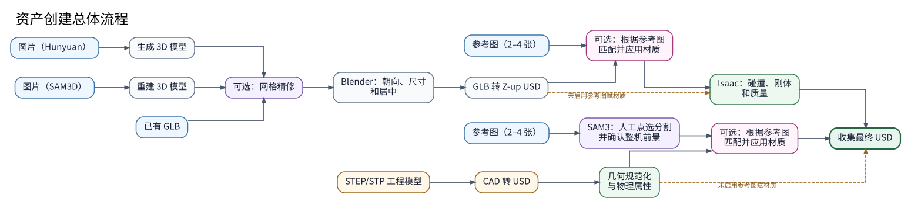

# 代码架构与调用关系

[English](./architecture.md) | [中文](./architecture.zh.md) | [文档索引](../README.zh.md)



Hunyuan 在生成阶段已经输出带视觉材质和纹理的 GLB；精修阶段负责迁移并保留这些纹理，
后续不会再进入参考图赋材质流程。图中的额外“材质参考图”只用于 SAM3D 重建结果或已有
GLB：转成 USD 后执行“参考图与 USD 零件建立对应关系 → 材质检索与匹配 → 绑定材质”。
STEP/STP 的正式 `manual-material-pipeline` 则先用 SAM3 人工点选确认参考图中的整机前景，
再与 CAD Part-ID 建立对应关系。

本页只说明模块职责和主要调用链。运行命令和调参方法请查看对应的流程文档。

## 分层结构

```text
CLI / HTTP API
    -> 工作流编排
        -> Job 与视觉材质阶段
            -> 统一子进程执行器
                -> Blender / Isaac Sim / 模型运行时 / 云 API
```

依赖只向下流动：任务模块不调用 CLI，外部运行时脚本也不负责组织完整流程。

## 主要模块

| 模块 | 职责 |
| --- | --- |
| `asset_pipeline/cli.py` | 解析命令行参数并选择工作流。 |
| `asset_pipeline/api.py` | 通过 FastAPI 后台任务运行相同工作流。 |
| `asset_pipeline/workflows.py` | 组合图片和 GLB 输入所需的 Job。 |
| `asset_pipeline/manual_cad.py` | 组合 STEP/STP 工作流。 |
| `asset_pipeline/jobs/` | 执行一次转换、精修、物理处理或交付检查。 |
| `asset_pipeline/visual_materials/` | 组织参考图驱动的材质赋值。 |
| `asset_pipeline/command.py` | 统一记录并执行子进程。 |
| `asset_pipeline/runtime.py` | 查找外部运行时并读取配置。 |
| `asset_pipeline/project_layout.py` | 解析仓库路径。 |
| `asset_refiner/` | 网格精修与纹理迁移。 |
| `tools/blender/` | 仅由 Blender 执行的脚本。 |
| `tools/isaac/` | 仅由 Isaac Sim 执行的脚本。 |
| `tools/sam3d/` | SAM3D 重建脚本。 |
| `tools/qwen_material_pipeline/` | 分割、图像分析、检索、材质选择与 USD 工具。 |

仓库根目录不再放 Python 实现文件。Python 公共接口统一从 `asset_pipeline` 导入；
`asset_pipeline/jobs/material.py` 只保留包内旧材质 Job 的兼容入口。

## 主命令分发

参考图驱动的 STEP/STP 材质正式命令只有一条明确的调用链：

```text
manual-material-pipeline
-> manual_material_cli.main
-> manual_cad.run_manual_cad_workflow
-> visual_materials.run_assign_visual_materials_job
-> qwen_material_pipeline / Isaac Sim 执行器
```

`python -m asset_pipeline.manual_material_cli` 是等价的模块入口。通用多输入命令继续负责
其他工作流：

```text
hunyuan-asset-pipeline
或：python -m asset_pipeline.cli
-> asset_pipeline.cli.main
   -> runtime.configure_runtime
   -> 根据输入选择工作流
```

```text
--manual-stp
-> manual_cad.run_manual_cad_workflow

--sam3d-input
-> workflows.run_sam3d_image_and_process_model_job

--sam3d-glb / --existing-glb
-> jobs.refine.run_refine_mesh_job
-> workflows.run_process_model_job

图片目录 / 图片 URL
-> workflows.run_generate_and_process_model_job
```

## 图片与 GLB 流程

Hunyuan 生成：

```text
workflows.run_generate_and_process_model_job
-> jobs.hunyuan.run_generate_model_job
-> jobs.refine.run_refine_mesh_job
-> workflows.run_process_model_job
```

SAM3D 重建：

```text
workflows.run_sam3d_image_and_process_model_job
-> jobs.sam3d.run_sam3d_image_job
   -> tools/sam3d/run_reconstruct.py
-> jobs.refine.run_refine_mesh_job
-> workflows.run_process_model_job
```

GLB 通用后处理：

```text
workflows.run_process_model_job
-> Blender 预检、轴对齐、可选尺寸调整和 GLB-to-USD
-> 可选参考图材质赋值
-> Isaac Sim 物理处理
-> USD 收集
-> 交付检查
```

精修细节见[网格精修](../modules/refine.zh.md)，Blender 和物理处理见
[Blender](../modules/blender.zh.md)与[物理处理](../modules/physics.zh.md)。

## STEP/STP 流程

手工建模 STEP/STP（CAD）流程保留源模型尺寸。每次参考图推理只接收一个 STEP/STP 装配体。

```text
manual_cad.run_manual_cad_workflow
-> jobs.cad.run_cad_to_usd_job
   -> tools/isaac/convert_cad_to_usd.py
-> jobs.isaac.run_add_physics_job(center_origin=True)
-> 可选 visual_materials.run_assign_visual_materials_job
-> jobs.isaac.run_collect_job
-> 可选交付检查和最终视觉检查
```

物理几何准备位于选材之前。部分程序化 MDL 会使用模型空间坐标，之后再修改单位或局部
原点可能改变纹理的大小和位置。相机对齐只用于比较渲染图与照片，不会旋转或缩放最终
交付的 CAD 几何。

该流程不接收 `len_x`、`len_y`、`len_z` 或 `orientation`。详细说明见
[CAD](../modules/cad.zh.md)和[材质快速开始](../guides/manual-part-id-materials.zh.md)。

## 视觉材质流程

公共入口由 `asset_pipeline.visual_materials` 导出，主流程只负责阶段顺序和跨运行时调用：

```text
run_assign_visual_materials_job
-> 输入、工作目录和相机信息
-> Qwen/MVInverse/检索
-> CAD 引导的 SAM3/EntitySeg Part-ID 信息
-> 材质计划与完整覆盖
-> 材质身份、必要的颜色校准和渲染比较
-> USD 绑定、锁定和最终交付检查
```

主要所有权：

- `context.py`、`workspace.py`：输入和产物路径；
- `stages/`：相机、推理、Part-ID 信息和最终检查；
- `policy_exact_cover.py`、`tournaments.py`、`quality_contracts/`：材质计划和质量判断；
- `tools/qwen_material_pipeline/`：模型适配、分割、检索、材质和 USD 工具。

模型只生成判断信息或候选，最终绑定由经过校验的代码执行。看不到的零件使用安全默认结果；
选定的 MDL 不会被后续阶段静默替换。使用方法见
[自动赋材质](../guides/manual-part-id-materials.zh.md)。

## 运行时与断点继续

顶层命令运行在 `hunyuan_sam3d` 环境中。Blender 和 Isaac Sim 使用各自的 Python。
Qwen 可以使用配置的 Python 3.11 环境；SAM3、MVInverse、SigLIP2 和 DINOv2 使用材质
配置中记录的运行时。

占用 GPU 的阶段按顺序运行，以降低峰值显存。可复用的视觉阶段会记录输入、模型版本、配置
和输出哈希。`--resume` 只用于同一份 `live` 输入；只有这些内容仍一致时才复用视觉结果。
模型阶段失败后，只有在已有分析结果可安全复用时才会用新进程重试一次。JSON 格式错误、
哈希不匹配或图像信息不足时，流程会停止，并在本次运行目录中保留诊断报告。
