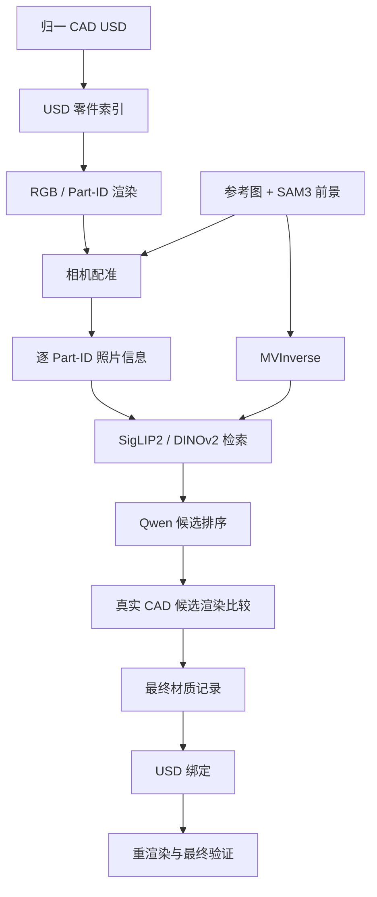

# 自动材质流水线架构

`qwen_material_pipeline` 是手工建模 STEP/STP 流程中的视觉材质子包。生产入口仍是仓库根目录的
`manual-material-pipeline`；本包不负责 CAD 转换或物理处理。

另见 [MVInverse](./mvinverse.zh.md) 和
[Base 材质观察库](./base_material_observation_bank.zh.md)。

## 1. 系统边界

完整顺序如下：

```text
STEP/STP
  -> CAD 转换后的 USD
  -> 几何与物理属性准备
  -> 参考图驱动的视觉材质
  -> USD 收集与最终验证
```

视觉材质阶段遵循四条约束：

1. 归一后的 USD 是只读几何输入；材质写入新的 USD 图层或目录。
2. Qwen、MVInverse 和检索模型只提供分析结果或候选，不能直接写 USD。
3. 选中的 Base MDL 保持原始参数，并保存到 `material_selection_lock.json`。
4. 输入、模型、配置和关键产物都用哈希绑定，变化后不能误用旧缓存。

视觉材质与物理属性相互独立。赋材质不得改变尺寸、姿态、拓扑、碰撞、质量或关节。

## 2. 主要目录职责

下表只列日常开发最常用的目录。

```text
tools/qwen_material_pipeline/
├── core/          # 通用数据结构和阶段合并
├── evidence/      # 相机配准、颜色、Part-ID 和置信度分析
├── materials/     # NVIDIA MDL 目录、候选和完整覆盖
├── mvinverse/     # MVInverse 调度与 PBR 分析
├── qwen/          # 本地/远程视觉模型调用
├── usd/           # 零件索引、渲染、绑定和验证
├── workflows/     # 子包工作流入口
├── configs/       # 生产配置
├── schemas/       # 跨阶段 JSON 数据格式
├── third_party/   # 固定版本的第三方源码
├── models/        # 本地权重；不进入源码发布包
├── web/           # 结果查看页面
├── scripts/       # 安装、检查和服务脚本
├── tests/         # 单元与集成测试
├── var/           # 可重建的本机数据
├── results/       # 本机验证结果
└── workspace/     # 临时工作目录
```

主仓库通过 `asset_pipeline/visual_materials/orchestrator.py` 调用本包；收集后的验收由
`asset_pipeline/jobs/delivery.py` 完成。

`third_party/` 和 `models/` 中的内容仍遵循各自许可。把它们放在项目目录中只是为了固定
版本和路径，不代表它们属于本项目代码。

## 3. 运行环境

| 环境 | 职责 |
| --- | --- |
| `hunyuan_sam3d` | 主流程、SAM3、MVInverse 和检索 |
| Qwen3.5 独立环境（`QWEN35_PYTHON`） | 本地视觉语言模型推理 |
| Isaac Sim Python | `pxr`、RTX 渲染、MDL 写入及 USD 验证 |
| Blender | Blender 专属网格操作 |

Qwen3.5 使用独立环境；其余模型阶段也通过子进程运行，以便及时释放 GPU。Isaac Sim 和
Blender 使用各自的 Python，不要把它们的包安装进 Conda 环境。

## 4. 调用关系



模块职责保持单向：

- `qwen/` 和 `mvinverse/` 不写 USD；
- `evidence/` 只生成和校验图像分析结果；
- `materials/` 生成候选及完整分配；
- `usd/` 只执行已经确定的计划；
- `web/` 只展示结果。

## 5. 主要阶段

1. 为归一 USD 建立稳定的装配实例和 Part-ID 索引。
2. 渲染 RGB、轮廓和 Part-ID 图，并把虚拟相机配准到每张参考图。
3. 从 SAM3 前景中提取每个可见 Part-ID 的颜色与局部外观；不可见零件单独标记。
4. 运行 MVInverse，得到 albedo、metallic、roughness、normal 和 shading 观测。
5. 用 SigLIP2、DINOv2 和数值外观从 `NVIDIA/Materials/Base` 检索候选。
6. Qwen 在有限候选中排序；候选再绑定到真实 CAD 零件并重渲染比较。
7. 为每个 Part-ID 生成一条分配。缺少可靠照片信息的零件使用可追溯的预设默认材质。
8. 保存最终材质记录、绑定 USD、重新渲染并验证收集后的结果。

同一连续外观跨越多个 Part-ID 时，
[同外观零件组件](./appearance_components.zh.md) 可以约束这些零件使用同一个 MDL；每个
Part-ID 仍保留独立绑定和选择记录。

## 6. 恢复与失败处理

`--resume` 会校验输入图片、CAD、配置、模型身份、数据格式和内容哈希。全部一致才会复用；
缺失或不匹配的阶段重新运行。格式错误、候选越界或图像信息不足会停止当前阶段，不会自动
补写模型输出或放宽门槛。

单张参考图失败时，该视图记录为不可用；可用视图数量不足时，整次材质推理停止。相机
配准结果也会分级使用：高质量视图作为全局锚点，较弱但可信的视图只提供局部零件信息。

## 7. 关键产物

| 文件 | 内容 |
| --- | --- |
| `part_registry.rendered.json` | Part-ID、prim 路径、可见性及渲染文件 |
| `camera_calibration_report.json` | 每个参考视图的相机与对齐质量 |
| `part_id_reference_evidence.json` | 逐 Part-ID 的照片信息 |
| `mvinverse_inference_ledger.json` | MVInverse 输入、版本、权重和输出哈希 |
| `part_id_qwen_choices.json` | 每个可见 Part-ID 的候选选择 |
| `complete_material_plan.json` | 覆盖全部 occurrence 的材质计划 |
| `material_selection_lock.json` | 最终 MDL、材质子集和源文件哈希 |
| `delivery_validation.json` | 选材时与收集后的 USD 交付检查 |

这些文件用于复现和排错，不应手工编辑。

## 8. 本机数据与发布

- `var/` 和 `workspace/` 可清理，但正在复验的运行应保留清单、推理记录和 PBR 图。
- `results/` 单独归档，不与源码发布包混装。
- 客户照片、模型权重、密钥和机器绝对路径不得进入源码包。
- `configs/`、`schemas/` 和允许再分发的第三方许可文件必须保留。

详细规则见[清理与交付规则](./maintenance/cleanup.zh.md)。

## 9. 查看结果

```bash
DELIVERY_DIR=./outputs/example/output_final \
  tools/qwen_material_pipeline/scripts/serve_results.sh 8088
```

访问 `http://127.0.0.1:8088/result_viewer/`。该服务没有鉴权，只适合可信本机或内网。
